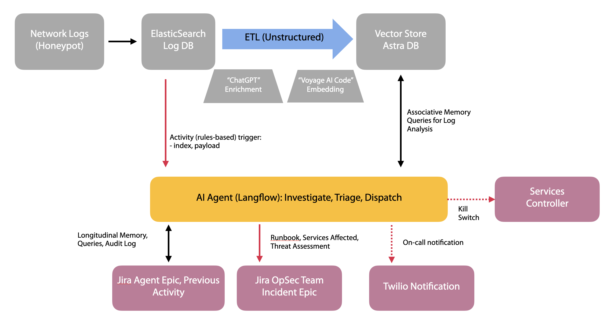

# cyberincident-ai-agent

For <b>Hacking Agents Hackathon SF, Mar 1 2025</b>

The goal of this AI agent is to provide a first layer of analysis and response to cyberthreats.  Network logs (in this case from honeypot servers) are pushed to an elastic search database.  There are event triggered rules in elastic search that send a notifier to the agent to evaluate situations, and if needed, to take action.  In the background, an unstructured ETL ingests new logs, and adds these to an AstraDB vector store.

Upon receiving the trigger

## General Screening rule for trigger

General Screening Rule: Flag any network activity that exhibits one or more of the following behaviors:

- Excessive Failed Authentication Attempts
More than X failed logins from the same IP within Y minutes.
- Unusual Port Access Patterns
Connection attempts to N or more different ports within a short time.
Access to high-risk ports (e.g., 22, 3389, 445, 1433, 3306).
- Abnormal Traffic Volume or Frequency
Data transfer or request rates exceeding Z times the normal baseline.
Repeated requests to the same endpoint from an unusual source.
- Suspicious String Patterns in Requests
Presence of SQL keywords (SELECT, DROP, UNION, etc.) in HTTP requests.
Commands in URLs (cmd.exe, wget, powershell, nc).
- Connections to Known Malicious Domains or IPs
Traffic to IPs or domains flagged as malicious by threat intelligence sources.
Repeated beaconing or periodic connections to the same external address.
- Unexpected New Device or User Behavior
First-time access to a system/resource from a user or device.
Network activity from an unknown or unauthorized MAC address.
- Unusual File or Process Execution (for honeypots)
Execution of non-whitelisted binaries or scripts.
Mass file encryption or deletion in a short period.

## Investigate and Triage

The following are three levels of triage, and relevant incidents:

🔴 Critical (Immediate shutdown, send Twilio SMS, prepare Jira ticket with custom runbook) → Ransomware, C2, DoS, Unpatched Exploits
🟠 High-Risk (Send Twilio SMS, prepare Jira ticket with custom runbook) → Brute Force, Malware, Insider Threat, DNS Tunneling
🟢 Suspicious (Prepare Jira ticket with custom runbook) → Port Scans, SQL Injection, Phishing, Rogue Devices

### Generic Investigation Tips (actual runbook produced on the fly based on system data)

1. Port Scanning
- Multiple connection attempts to different ports from the same IP in a short period.
- Unusual traffic to uncommon ports.
- Logs showing SYN packets without full connections (indicative of SYN scanning).

2. Brute Force Attack (Credential Stuffing)
- Repeated failed login attempts from the same IP.
- Large volume of authentication requests in a short time.
- Logs showing many attempts with different usernames/passwords.

3. Malware Installation (Payload Delivery)
- Execution of suspicious scripts or binaries.
- Network logs showing download requests for known malware URLs.
- Changes in system files or registry indicative of persistence mechanisms.

4. SQL Injection (Database Exploitation)
- Logs showing requests with SQL keywords (SELECT, UNION, DROP, --, etc.).
- Repeated failed database queries from the same IP.
- Sudden spikes in database query logs.

5. Phishing Attack (User Credential Theft)
- Network logs showing redirections to known phishing domains.
- HTTP requests with fake login forms or credential submission.
- Emails containing suspicious links or attachments.

6. Ransomware Activity
- Large-scale encryption of files detected in system logs.
- Outbound network traffic to known ransomware command-and-control (C2) servers.
- Deletion of shadow copies and backup files in system logs.

7. Command and Control (C2) Communication
- Connections to known malicious IPs or domains.
- Repeated beaconing behavior at regular intervals.
- Encrypted traffic over unusual ports.

8. Insider Threat (Data Exfiltration)
- Large volume of outbound data transfers to external servers.
- Access to sensitive files at unusual hours.
- Logs showing unauthorized access attempts to restricted areas.

9. Denial of Service (DoS/DDoS)
- Spike in traffic volume from a single or distributed set of IPs.
- Repeated requests overwhelming a service endpoint.
- High failure rates for legitimate requests due to service degradation.

10. Exploitation of Unpatched Vulnerabilities
- Requests with exploit signatures targeting known CVEs.
- Traffic attempting to use outdated or deprecated protocols.
- Logs showing privilege escalation attempts post-exploitation.

11. DNS Tunneling (Data Theft via DNS Queries)
- Excessively long or unusual domain name queries.
- High volume of DNS requests from a single host.
- Querying domains with known malicious signatures.

12. Rogue IoT or Unauthorized Devices
- New, unrecognized MAC addresses appearing on the network.
- Devices making unexpected outbound connections.
- Logs showing authentication attempts from unauthorized hardware.

